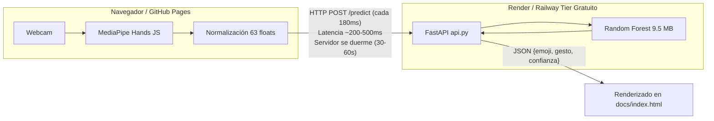
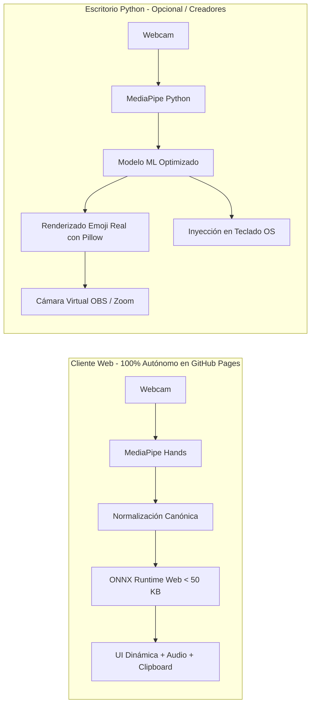

# 🗺️ Plan Maestro de Mejoras - Hand2Emoji

Este documento describe la hoja de ruta integral para evolucionar el proyecto **Hand2Emoji**, organizando las mejoras técnicas en **5 fases incrementales**. El objetivo es transformar el proyecto en una aplicación de alto rendimiento, 100% independiente de servidores externos en su versión web, más precisa para diversos usuarios y con funcionalidades avanzadas tanto en la web como en escritorio.

---

## 📊 Diagnóstico y Arquitectura

### Arquitectura Actual (Dependiente de Backend)

### Arquitectura Objetivo (Edge AI / Inferencia Local 60 FPS)

---

## 🎯 Fases del Plan de Implementación

El plan se divide en 5 documentos detallados dentro del directorio [`docs/plan/`](file:///c:/Users/USUARIO/Desktop/Proyectos/Hand2Emoji/docs/plan/):

| Fase | Documento | Alcance Principal | Impacto |
| :---: | :--- | :--- | :---: |
| **01** | [01_calidad_y_arquitectura_base.md](file:///c:/Users/USUARIO/Desktop/Proyectos/Hand2Emoji/docs/plan/01_calidad_y_arquitectura_base.md) | Corregir encoding de requirements, separar dependencias y crear módulo común `gestures_common.py`. | 🔴 Crítico |
| **02** | [02_modelo_ml_y_data_augmentation.md](file:///c:/Users/USUARIO/Desktop/Proyectos/Hand2Emoji/docs/plan/02_modelo_ml_y_data_augmentation.md) | Espejado canónico de manos, Data Augmentation, balanceo y exportación a ONNX (< 50 KB). | 🟠 Alto |
| **03** | [03_inferencia_cliente_onnx_web.md](file:///c:/Users/USUARIO/Desktop/Proyectos/Hand2Emoji/docs/plan/03_inferencia_cliente_onnx_web.md) | Inferencia local con ONNX Runtime Web. Elimina Render y las esperas de inicio. | 🚀 Game Changer |
| **04** | [04_experiencia_frontend_ux.md](file:///c:/Users/USUARIO/Desktop/Proyectos/Hand2Emoji/docs/plan/04_experiencia_frontend_ux.md) | Auto-copiado al portapapeles, acumulador de emojis, feedback sonoro y ajuste de sensibilidad. | 🟡 Medio-Alto |
| **05** | [05_detector_desktop_y_streaming.md](file:///c:/Users/USUARIO/Desktop/Proyectos/Hand2Emoji/docs/plan/05_detector_desktop_y_streaming.md) | Renderizado real de emojis en pantalla con Pillow, emisión a cámara virtual y teclado macro. | 🟢 Creativo |

---

## 📋 Checklist Global de Seguimiento

### Fase 1: Calidad de Código y Módulos Base
- [x] Convertir `requirements.txt` de UTF-16LE a UTF-8 sin BOM.
- [x] Crear `requirements-dev.txt` con librerías completas (`opencv-python`, `mediapipe`, `seaborn`).
- [x] Crear módulo `gestures_common.py` con `EMOJI_MAP` y `extraer_caracteristicas`.
- [x] Refactorizar scripts existentes (`recolector.py`, `entrenador.py`, `detector.py`, `api.py`).

### Fase 2: Optimización de Machine Learning
- [x] Implementar normalización canónica (inversión de coordenada $X$ en mano izquierda).
- [x] Añadir generador de Data Augmentation sintético (jittering y rotaciones leves).
- [x] Entrenar modelo optimizado ligero (MLP o Random Forest con poda de profundidad).
- [x] Exportar pipeline completo a formato abierto `modelo.onnx`.
- [x] Exportar metadatos a `labels.json` para consumo directo en JavaScript.

### Fase 3: Inferencia Web On-Device (Zero Backend)
- [x] Integrar librería CDN de `onnxruntime-web` en `docs/index.html`.
- [x] Cargar `modelo.onnx` y `labels.json` estáticamente desde GitHub Pages.
- [x] Implementar tensor feed y softmax en cliente JavaScript.
- [x] Retirar dependencias del servidor Render y eliminar estado "Despertando servidor".

### Fase 4: Experiencia de Usuario Web (UI / UX)
- [x] Añadir botón "Copiar Emoji", auto-copiado y toast efímero.
- [x] Crear barra de composición / historial de emojis estilo teclado flotante.
- [x] Añadir feedback sonoro sutil y click háptico con Web Audio API (síntesis de ondas).
- [x] Agregar selector de velocidad/sensibilidad de detección (0.5s, 0.8s, 1.3s).
- [x] Rediseño minimalista estricto (monocromo, Plus Jakarta Sans, JetBrains Mono, sin clichés vibecoded).

### Fase 5: Detector de Escritorio Avanzado
- [x] Reemplazar dibujo de texto de OpenCV por renderizado Unicode de emojis con Pillow y fuentes de color del sistema (`EmojiRenderer`).
- [x] Añadir soporte para emitir a cámara virtual de OBS/Zoom/Meet con `pyvirtualcam`.
- [x] Añadir modo opcional de pulsación de teclas e inyección en portapapeles con `pyautogui` y `pyperclip` (`MacroManager`).
- [x] Desacoplar procesamiento con `procesar_frame()` y soporte de argumentos CLI (`--virtualcam`, `--macro`, `--cam`, `--no-gui`).

---

## 📈 Métricas de Éxito esperadas

| Métrica | Estado Actual | Meta con el Plan |
| :--- | :--- | :--- |
| **Latencia por predicción** | ~250 - 600 ms (vía red HTTP) | **< 5 ms** (en navegador con ONNX) |
| **Tiempo de arranque frío** | 30 - 60 s (servidor Render dormido) | **Instantáneo** (0 s) |
| **Costo de Hosting** | Limitado al tier gratuito con apagados | **$0 permanente** (GitHub Pages) |
| **Tamaño del modelo** | 9.5 MB (`modelo.pkl`) | **< 50 KB** (`modelo.onnx` / MLP) |
| **Disponibilidad** | 95% (depende de API externa) | **100%** (funciona sin conexión) |

