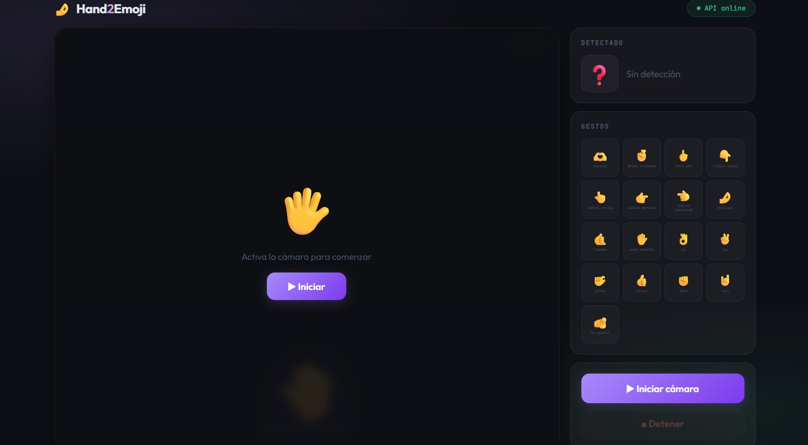
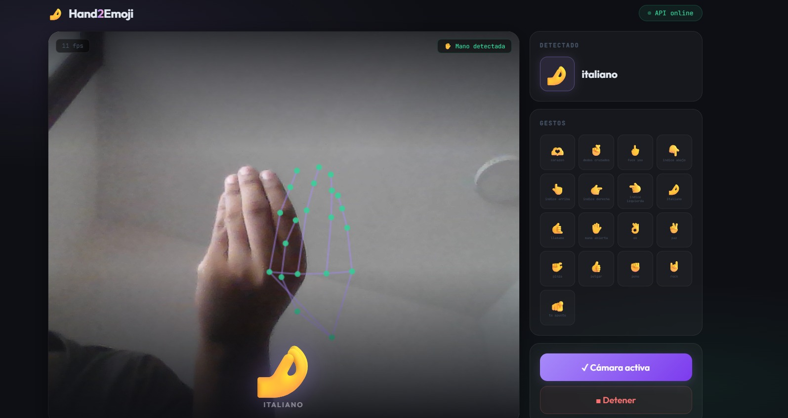
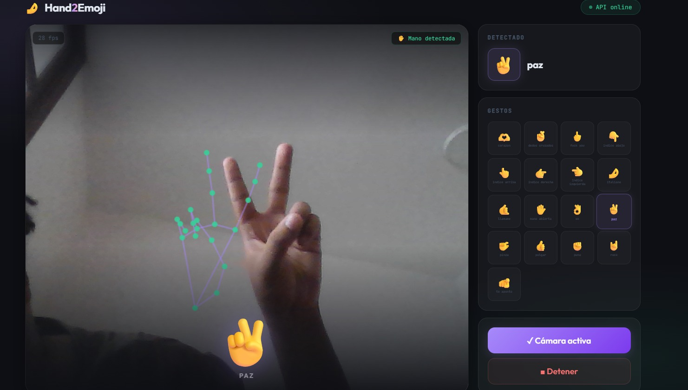

# Hand2Emoji

Reconocimiento de gestos de mano en tiempo real que convierte tus movimientos en emojis, corriendo completamente en el navegador.

**[Demo en vivo](https://luxury213.github.io/hand2emoji)** — sin instalación.

---

## Cómo funciona

MediaPipe corre del lado del cliente y extrae 21 landmarks de la mano por frame. Esos landmarks se normalizan y se envían como 63 floats a un backend en FastAPI, donde un clasificador de scikit-learn predice el gesto y retorna el emoji correspondiente.

El trabajo pesado (cámara + detección de mano) ocurre en el navegador del usuario. El servidor solo recibe números y devuelve una etiqueta, por eso el tier gratuito de Railway es más que suficiente.

---

## Capturas





---

## Stack

| | |
|---|---|
| Detección de mano | MediaPipe Hands (client-side) |
| Backend | FastAPI + Uvicorn |
| Modelo | scikit-learn |
| Frontend | GitHub Pages |
| API | Railway |

---

## Entrenamiento del modelo

No hay dataset externo — todos los datos fueron recolectados manualmente por mi. Con `recolector.py` grabé 150 muestras por gesto con mis propias manos frente a la webcam. MediaPipe extrae los 21 landmarks por frame, se normalizan y se guardan en un CSV. Ese proceso lo repetí para los 17 gestos.

El entrenamiento corre con `entrenador.py`, que lee el CSV, ajusta un scaler y un clasificador, y guarda cuatro archivos en `models/`: el clasificador, el scaler, el label encoder y un archivo de metadata con el mapa de gestos a emojis.

```bash
python recolector.py   # grabar 150 muestras por gesto
python entrenador.py   # entrenar y guardar modelo
```

Que los datos vengan de una sola persona significa que el modelo es intencionalmente personal — fue entrenado con mis proporciones de mano y mis condiciones de iluminación, lo que afecta qué tan bien generaliza a otros usuarios. Es un tradeoff conocido y un área interesante para mejorar.

---


## Estructura del proyecto

```
hand2emoji/
├── api.py              # API REST
├── detector.py         # lógica de inferencia
├── recolector.py       # recolección de datos
├── entrenador.py       # entrenamiento del modelo
├── requirements.txt
├── models/
│   ├── modelo.pkl
│   ├── scaler.pkl
│   ├── labels.pkl
│   └── metadata.pkl
└── docs/
    └── index.html      # frontend
```

## Qué aprendí

La decisión más importante del proyecto no fue técnica sino conceptual: en vez de trabajar con imágenes, enfoqué todo en landmarks de mano. Eso simplificó enormemente el pipeline no necesitaba procesar píxeles, solo coordenadas y me llevó a investigar a fondo cómo funciona MediaPipe por dentro.

También aprendí bastante sobre recolección de datos. No es solo grabar muestras — es grabar muestras útiles. Recolecté cada gesto de frente, de perfil, con distintas iluminaciones y haciendo cada emoji de formas ligeramente diferentes. Ese proceso me hizo entender que la calidad del dataset importa más que el modelo en sí.

En cuanto al alcance, decidí mantener el foco en manos. Podría extenderse a expresiones faciales en el futuro, pero de momento ese límite le da autenticidad al proyecto y es honesto con lo que el modelo puede hacer bien.

Por último, construir e integrar la API fue nuevo para mí. Entender cómo el frontend y el backend se comunican, cómo se estructura un endpoint y cómo se hace un deploy real fue tanto o más valioso que el modelo en sí.
